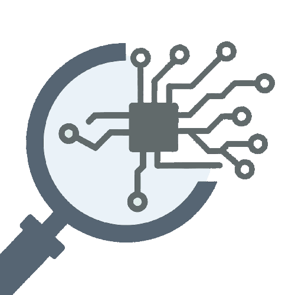

# Codetective 

Code AI authorship detection in five clicks.

Codetective is a purely client-side WASM app built with [Leptos](https://leptos.dev/) + [Tailwind CSS](https://tailwindcss.com/) and packaged with [Trunk](https://trunkrs.dev/); this, I believe, is the best way to develop client-side applications as of now.

## Usage

Try it out at: <https://josehu.com/apps/codetective>

## Development

Open live reload for development with:

```bash
trunk serve --open
```

Build with minimization optimizations with:

```bash
trunk build --release -M --public-url="/apps/codetective"
```

---

Over 70% of its own code is written by LLMs – funny, isn't it. I took the development of Codetective as an opportunity to learn AI-aided front-end development, and it's fair to say the experience is pretty good.
